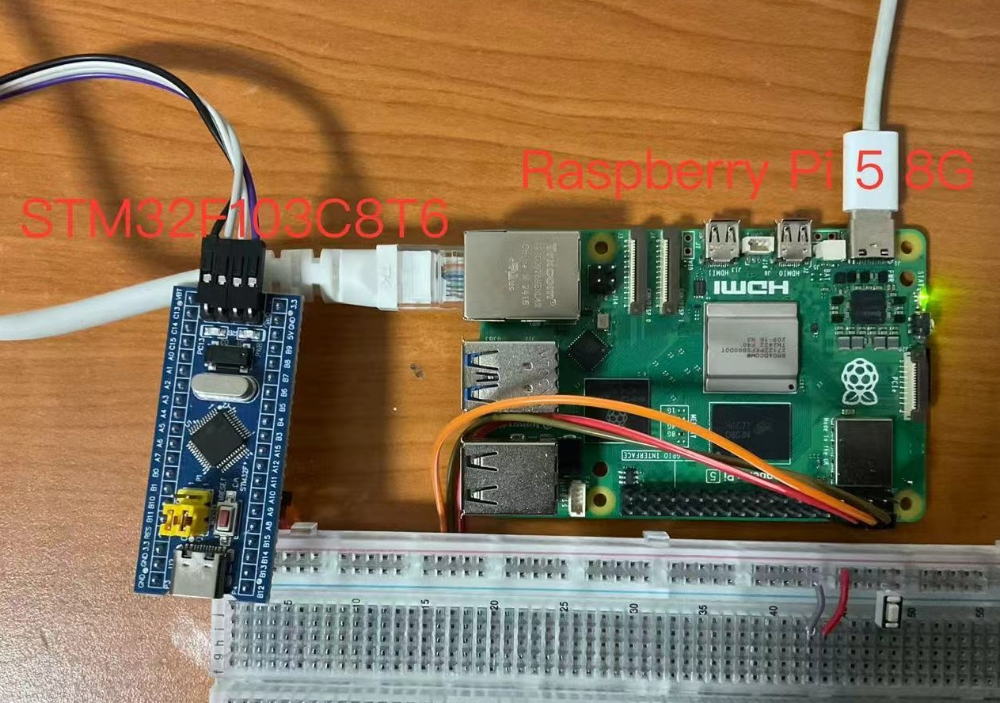
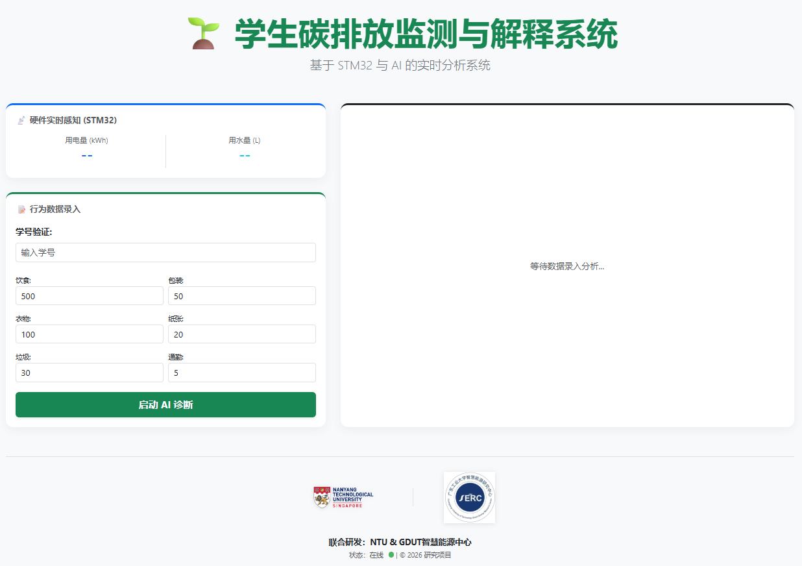

# Eco-ML-Monitor: 基于AIoT与解释性机器学习的碳排放监测系统

## 1. 项目简介
本项目是一款专为校园/工业场景设计的**实时碳排放监测与只能诊断系统**。系统通过底层硬件采集能源消耗数据，利用 Flask 构建后端 Web 服务器，并集成K-Means, 分类和SHAP (SHapley Additive exPlanations) 解释性机器学习算法，为用户提供“透明”的碳排放诊断结果。该项目已实现在树莓派 5 上的工业级稳定部署，并通过 cpolar 实现公网映射，支持移动端随时随地访问。

**项目创新**
> 1. 跨学科继承: 将机械电子（STM32）与计算机科学（AI/Web）深度结合。
>  2. AI 透明化：不仅给结论（评级），还给理由（SHAP 解释），符合目前工业 4.0 对 AI 可信度的要求
>  3. 高可用性：完成了从“能跑通的代码”到“稳定的服务器产品”的转变。

**本项目所用到学术支撑与链接**

> 1. 系统网络链接: http://ecosystem-rbpi.cpolar.cn/ **(本链接仅次于树莓派接上电时候才可进入否则为404报错)**
> 2. 本项目基于的学术基础: https://doi.org/10.1007/s10668-025-07035-0
> 3. 本项目基于的项目基础: https://github.com/zhiwenC125/ML_Assisted_Students_Carbon_Emission

**注意事项**

* 本项目实验的stm32所采取为模拟生成传感器的信号，当stm32未能接上电源是，由后端所保证网站的运行，提供的**静态**的水电数据，因此网页水电部分会保持为450和12的数值

## 2. 技术栈

* 硬件层: STM32 微控制器 (数据采集), 树莓派 5 (核心网关)
* 后端/算法: Python 3, Flask, Pandas, Scikit-learn
* 可解释性 AI: SHAP (提供特征贡献度分析)
* 前端: HTML5, CSS3 (响应式布局), Jinja2 模板引擎
* 部署/运维: Conda (环境隔离), Systemd (服务自动化), cpolar (内网穿透)

## 3. 核心功能
* 实时监测: 远程读取由 STM32 采集并传输至树莓派的用电、用水等能源数据。
* 智能诊断: 用户输入 ID 后，系统自动调用机器学习模型进行碳排放评级（低、中、高）。
* AI 可解释性: 网页动态生成 SHAP 解释图，直观展示哪些行为（如过高的空调耗电或用水）导致了当前的碳排放评级。
* 响应式 UI: 深度适配移动端，底部集成高清学校 Logo（如校徽），提升界面专业感。

## 4. 具体实现
### 1. 数据采集与传输层 (Hardware Layer)
这是系统的“感知器官”。

* STM32 端：利用 STM32 的 ADC（模数转换）和 GPIO 接口，实时采集电力传感器（用电量）和流量传感器（用水量）的数据。

* 通信链路：通过串口（USART/UART）将打包好的数据包发送至树莓派。为了保证数据准确，通常会设计一个简单的帧格式（如 Header + Data1 + Data2 + Tail）。

* 树莓派处理：树莓派作为“网关”，运行 Python 脚本监听串口，将接收到的十六进制或字符串数据解析为 Pandas 能够处理的数值。

### 2. 核心算法与 AI 诊断层 (Intelligence Layer)
这是系统的“大脑”，负责将原始数据转化为决策建议。

* 机器学习模型：首先用聚类进行分类的伪标签生成，然后预先训练了一个分类模型（如 Random Forest 或 XGBoost）。它根据历史数据，将不同的能源消耗组合划分为：低碳、中碳、高碳三个等级。

* SHAP 可解释性分析：这是项目的高级特性。传统的 AI 是黑盒，但引入了 SHAP 算法进行可解释性分析

    * 实现原理：当用户点击诊断时，SHAP 会计算当前每一个输入特征（比如“空调耗电量”）对最终评级的“贡献值”。

    * 可视化：后端会自动生成一张 shap_summary.png，直观地告诉用户：“是因为空调耗电超过了 80% 的同类用户，才导致你被评为高碳”。

### 3. Web 后端服务层 (Software Layer)
这是系统的“中枢”，负责协调数据和交互。

* Flask 框架：使用 Flask 搭建轻量级服务器。

    * 路由设置：/ 负责渲染主界面，/diagnose 负责接收前端请求并调用 AI 模型。

* Conda 环境管理：通过 Miniconda 隔离出专门的虚拟环境，确保项目所需的 pandas、scikit-learn 和 shap 等库版本不会与系统自带环境冲突。

* 前端交互：使用 Jinja2 模板引擎将后端计算出的实时数据和图片路径注入到 HTML 中。通过响应式 CSS 布局，确保手机端访问时校徽不遮挡、图片不越界。

### 4. 工业级稳健性部署 (DevOps Layer)
这是确保系统能够 **“24/7 挂机稳定运行”** 的关键。

* Systemd 自动化：通过编写 .service 配置文件，将 Flask 应用注册为 Linux 系统服务。

    * 自启动：树莓派上电即运行，无需人工干预。

    * 自动重启：如果程序崩溃，系统会在 5-10 秒内自动拉起。

* cpolar 内网穿透：通过安全的 TLS 隧道，将本地 127.0.0.1:5000 端口映射到固定的公网二级域名。这让项目摆脱了实验室局域网的限制，变成了真正的“云监测平台”。

## 5. 部署步骤 (针对树莓派 Linux 环境)
**环境准备**
1. 安装 Miniconda 并创建虚拟环境：

```Bash
conda create -n carbon_env python=3.10
conda activate carbon_env
pip install flask pandas scikit-learn shap
```
**自动化部署 (Systemd)**
本项目已实现开机自启，确保在无人值守的情况下 24/7 稳定运行。

1. 将 eco_web.service 文件放置于 /etc/systemd/system/ 路径。

2. 配置启动脚本 run_app.sh：

```Bash
#!/bin/bash
source /home/pi/miniconda3/etc/profile.d/conda.sh
conda activate carbon_env
cd /path/to/your/web_app
python app.py
```
3. 激活服务：

```Bash
sudo systemctl enable eco_web.service
sudo systemctl start eco_web.service
```
**公网映射**
使用 cpolar 将本地 5000 端口映射至固定公网域名，方便演示与远程监控。

## 6. 项目结构
```Plaintext
├── data
├── hardware/              # STM32 采集端代码 (C/C++)
├── models                 # 模型pkl文件存储
│   └── models.pkl         # 模型训练文件
├── web_app/               # Flask Web 端
│   ├── app.py             # 后端核心逻辑
│   ├── static/            # 静态资源 (校徽图片、CSS、生成的 SHAP 图)
│   └── templates/         # 前端 HTML 模板
├── scripts/               # 部署与启动脚本 (.sh, .service)
├── README.md              # 项目说明文档
└── requirements.txt       # 库依赖文件
```

## 7. 系统预览
| |  |
|:----------------------:|:----------------------:|
| 客户端页面              | 管理员页面              |

* 诊断界面: 包含实时数据看板。
* 诊断结果: SHAP 柱状图清晰解释了排放因素的权重。
* 模型重训练: 当积累足够的数据之后可以迭代升级模型

## 8. 开发者
* 开发人员: Alan
* 背景: 机械工程研究生
* 联系方式: Zhiwc125@gmail.com